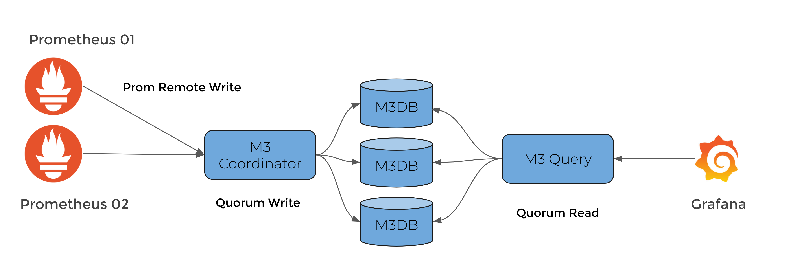

# M3 Workshop environment
 
## About

This repository contains all neccessary bits to run the M3 workshop stack locally.


## Getting started

Download [Docker Desktop](https://www.docker.com/products/docker-desktop) for Mac or Windows. [Docker Compose](https://docs.docker.com/compose) will be automatically installed. On Linux, make sure you have the latest version of [Compose](https://docs.docker.com/compose/install/). 


### Stack overview

The stack consists of the latest versions of these components:

- A standalone M3DB node or a cluster of 3 nodes;
- [M3 Coordinator](https://m3db.io/docs/m3coordinator/) and [M3 Query[https://m3db.io/docs/m3query/] instances to interact w/ [M3DB](https://m3db.io/docs/m3db/);
- Two [Prometheus](https://prometheus.io/docs/introduction/overview/) instances;
- A single [Grafana](https://grafana.com/) instance.

Both Prometheus instances are configured to scrape itself and a slightly different sets of services, thus during the 
workshop we'll see how querying the data on separate Prometheus instances we're going to get slightly different results. 

M3 Coordinator instance is taking all read and write requests and then distributing them to the cluster of M3DB nodes. It also implements Prometheus Remote Read and Write HTTP endpoints, which we're going to use by configuring Prometheus instances to use it during the workshop.

At the startup Grafana will be configured to use 3 different data sources pointing to:

- [Prometheus instance 1](http://localhost:9090)
- [Prometheus instance 2](http://localhost:9091)
- [M3 Query endpoint](http://localhost:7221)



### Starting the stack

Run the following command in this directory:

```$:~ docker-compose up```

Once you see the following output, the stack is configured and ready to be used: 

```
provisioner_1      | Waiting until shards are marked as available
provisioner_1      | Provisioning is done.
provisioner_1      | Prometheus available at http://localhost:9090
provisioner_1      | Prometheus replica is available at http://localhost:9091
provisioner_1      | Grafana available at http://localhost:3000
m3-workshop_provisioner_1 exited with code 0
```

Logs of the `provisioner` process can be seen either by following the output of the `docker-compose up` or by running the following command: ```docker-compose logs provisioner```

To run the M3 stack consisting of a single M3DB node, run the following command in this directory:

```$:~ docker-compose -f single-node.yml up```

Once the stack is up and running, use `http://localhost:3000` URL to login into the Grafana using `admin:admin` credentials and then head to the [Explore](http://localhost:3000/explore) tab.

### Sending Prometheus metrics to the M3DB cluster

To start sending metrics scraped by Prometheus instances to the M3DB cluster, we need to enable remote write functionality: 

- Uncomment both `remote_read` and `remote_write` blocks in `./config/prometheus/prometheus01.yml` and `./config/prometheus/prometheus02.yml` config files;
- Run `docker-compose restart prometheus01 prometheus02`;
- Once they're reloaded, head to the [Explore](http://localhost:3000/explore) tab and switch to the `M3 Query` data source to run PromQL queries.

### Spinning down the stack

Press `Ctrl+C` to interrupt the already running `docker-compose up` process, or run the following command:

```$:~ docker-compose down```

**NOTE:** it leave container disks intact. If you want to get rid of the data as well, run the following command:

```$:~ docker-compose down -v```

Stopping down the single M3DB node stack is done by running the following command:

```$:~ docker-compose -f single-node.yml down -v```


## Notes

It's recommended to run `Docker` engine w 8 GiB of memory allocated to it to ensure smooth operation of the stack during the workshop. In case you don't have enough memory, a single node M3DB stack can be used (single-node.yml Docker-compose file).
